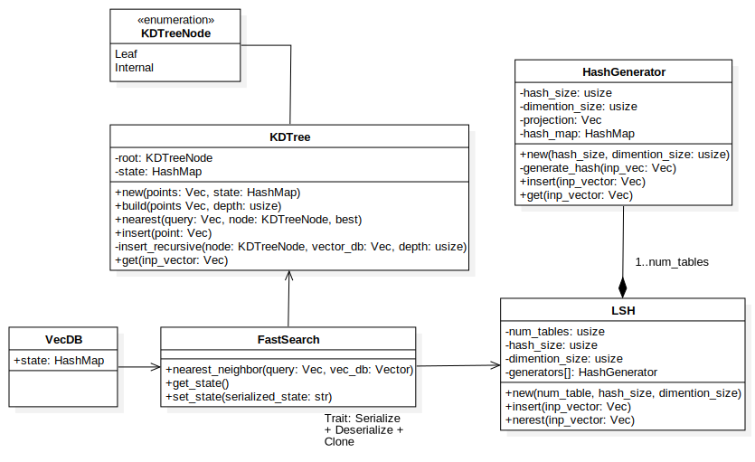

<center>


### Vector Database Project. </center>


      

Open source project written in Rust for vector database retrieval storage system.

### Features.

- Stores vector representation of any object
- Fast search via special data structures:
    Fast Search via:
    - KDTrees (implemented)
    - Locality-Sensitive Hashing (on build)

- integration for HDFS and S3 file systems 
- support of PyTorch vectors
- support of Python/Mojo APIs
- UI based on Actix or Rocket Rust Backend

#### Dependencies:

```toml
[package]
name = "vector_database"
version = "0.1.0"
edition = "2021"

[dependencies]
pyo3 = { version = "0.18", features = ["extension-module"] }
ndarray = "0.15"
rand = "0.8"
serde = { version = "1.0", features = ["derive"] }
serde_derive = "1.0"
serde_json = "1.0"

[lib]
crate-type = ["cdylib"]
```

Architecture:

Currently the project archiecture includes the structs responsible for the algorithms and storage.



---

for contribution, open the [link](contribution.md).


The project currently under the development.